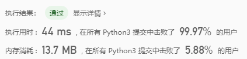

# LeetCode题解：0003（无重复字符的最长子串）

[题目链接](https://leetcode-cn.com/problems/add-two-numbers/)（中等）

| 解法           | 执行用时        | 内存消耗        |
| -------------- | --------------- | --------------- |
| Ans 1 (Python) | 3356ms (>5.01%) | 13.8MB (>5.88%) |
| Ans 2 (Python) | 44ms (>99.97%)  | 13.7MB (>5.88%) |



解法一（分别计算以每个字为起点的最长无重复子串）：

```python
def lengthOfLongestSubstring(self, s: str) -> int:
    ans = 0
    for i in range(len(s)):
        hashset = set()
        sub_ans = len(s) - i
        for j in range(len(s[i:])):
            if s[i:][j] in hashset:
                sub_ans = j
                break
            hashset.add(s[i:][j])
        if sub_ans > ans:
            ans = sub_ans
    return ans
```

解法二（分别判断以每个字为结束的最长无重复子串；即遇到重复的字符，则判断是否移动起始下标的位置）：

```python
def lengthOfLongestSubstring(self, s: str) -> int:
    hashmap = {}  # 距离当前位置最近的字符坐标
    max_long = 0  # 最大长度
    now_long = 0  # 当前位置长度
    for i, c in enumerate(s):
        now_long += 1
        if c in hashmap and i - hashmap[c] < now_long:
            now_long = i - hashmap[c]
        hashmap[c] = i
        if now_long > max_long:
            max_long = now_long
    return max_long
```

